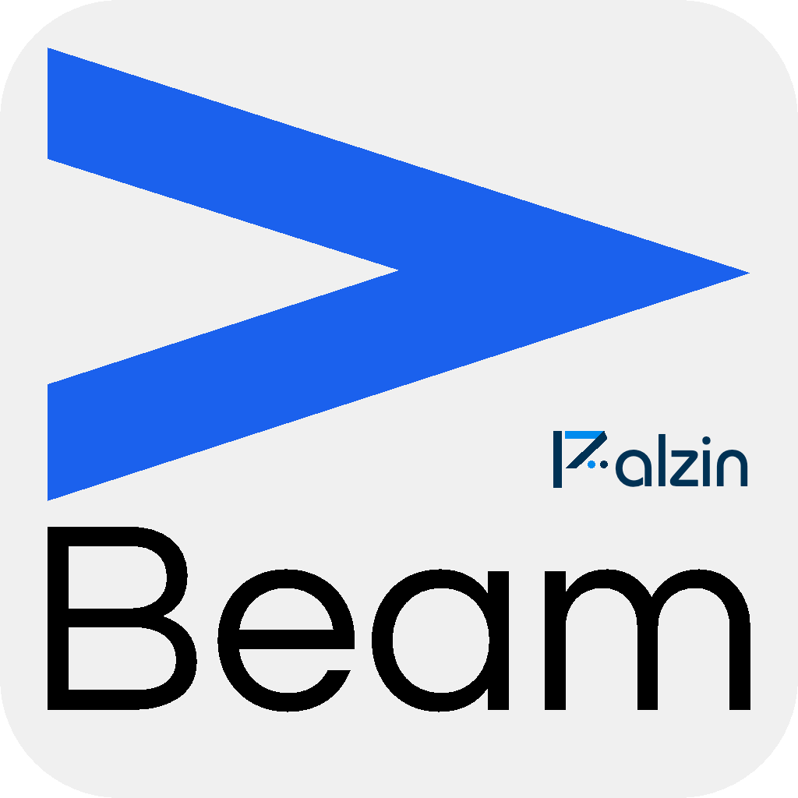

<p align="center">
  
</p>
<h1 align="center">Beam Core</h1>

 <div align="center">
 <p align="center">
      
      
      
  </p>
 </div>

### 👋 Hello Dev,

<br/>

Beam is a friendly app designed to boost your PHP coding and debugging experience.

When using Beam, you can see the result of your debug displayed in a standalone Desktop application.

### Get Started

#### Requirements

PHP 8.0+

#### Usage

1. Download the 🖥️ **Beam Desktop App** from [Palzin Beam](https://palzin.app/beam).
   
2. Install Beam Core in your PHP project, run the command:

```shell
 composer require palzin/beam-core --dev
 ```

3. Configure Beam, run:

```shell
vendor/bin/beam configure
 ```
4. Add a `ds()` function somewhere in your code.

Here's an example:

```php
// File: index.php

<?php 

//... some PHP code ...

ds('Hello from Beam!');
```
